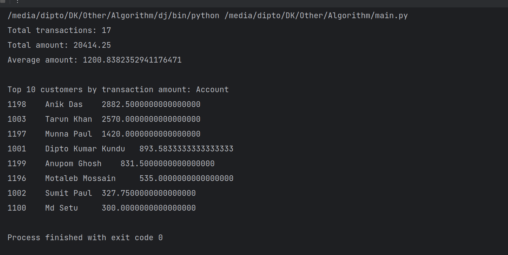

# Project Run with main.py
### install psycopg2
```
pip install psycopg2
```

### ADD Database in db_connection.py
- user = "bank_user"
- password = "mypassword"
- host = "127.0.0.1"
- port = "5432"
- database = "bank_db_name"

## PSQL Schema
### 1. Accounts Table 
#### Create accounts table
```
CREATE TABLE accounts (
    account_number INT PRIMARY KEY,
    account_holder_name VARCHAR(100),
    age INT,
    father_name VARCHAR(100),
    mother_name VARCHAR(100),
    profession VARCHAR(100)
);
```
#### Add data 

```
INSERT INTO accounts (account_number, account_holder_name, age, father_name, mother_name, profession)
VALUES
    (1001, 'Dipto Kumar Kundu', 35, 'Basudeb Kundu', 'Lilima Kundu', 'Engineer'),
    (1002, 'Sumit Paul', 28, 'Dev Paul', 'Mis Paul', 'Teacher'),
    (1003, 'Tarun Khan', 42, 'Milton Khan', 'Linda Khan', 'Doctor'),
    (1100, 'Md Setu', 25, 'Basudeb Lee', 'Habiba Khatun', 'Accountant'),
    (1196, 'Motaleb Mossain', 39, 'Habib Mossain', 'Mis Mossain', 'Lawyer'),
    (1197, 'Munna Paul', 33, 'Basudeb Paul', 'Tumpa Paul', 'Artist'),
    (1198, 'Anik Das', 45, 'Milton Das', 'Dolla Das', 'Architect'),
    (1199, 'Anupom Ghosh', 29, 'Dev Ghosh', 'Puja Ghosh', 'Professor');
```

### 2. Transactions Table
#### Create transactions table
```
CREATE TABLE transactions (
    transaction_id SERIAL PRIMARY KEY,
    account_id INTEGER NOT NULL REFERENCES accounts(account_number),
    date DATE,
    description VARCHAR(255),
    amount DECIMAL(10, 2),
    account_type VARCHAR(50)
);
```
#### Add data
```
INSERT INTO transactions (account_id, date, description, amount, account_type)
VALUES
    (1001, '2023-09-29', 'Grocery Shopping', 1550.75, 'Savings'),
    (1001, '2023-10-02', 'Utility Bill Payment', 480.00, 'Savings'),
    (1001, '2023-10-04', 'Dinner at a restaurant', 650.00, 'Savings'),
    (1002, '2023-09-30', 'Gasoline purchase', 430.50, 'Checking'),
    (1002, '2023-10-03', 'Movie tickets', 225.00, 'Checking'),
    (1003, '2023-10-01', 'Electronics Purchase', 2020.00, 'Savings'),
    (1003, '2023-10-05', 'Clothing Shopping', 3120.00, 'Savings'),
    (1100, '2023-10-06', 'Grocery Shopping', 455.00, 'Checking'),
    (1100, '2023-10-08', 'Coffee Shop', 145.00, 'Checking'),
    (1196, '2023-10-10', 'Gasoline purchase', 340.00, 'Savings'),
    (1196, '2023-10-12', 'Dinner at a restaurant', 730.00, 'Savings'),
    (1197, '2023-10-14', 'Electronics Purchase', 2350.00, 'Savings'),
    (1197, '2023-10-16', 'Utility Bill Payment', 490.00, 'Checking'),
    (1198, '2023-10-18', 'Grocery Shopping', 5445.00, 'Savings'),
    (1198, '2023-10-20', 'Movie tickets', 320.00, 'Checking'),
    (1199, '2023-10-22', 'Clothing Shopping', 1340.00, 'Savings'),
    (1199, '2023-10-24', 'Dinner at a restaurant', 323.00, 'Savings');
```
# RUN main.py
## Out put
